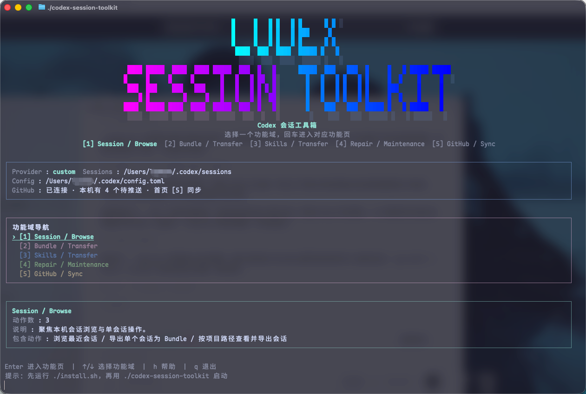

# Codex Session Toolkit

`Codex Session Toolkit` 是一个面向 Codex 会话的浏览、迁移、导入导出和修复工具箱。
它不是单一的 clone 脚本，而是一套统一的 TUI + CLI，用来处理会话管理里最常见的几类问题。



## 适用场景

如果你经常在 Codex Desktop 和 CLI 之间切换，或者有多台机器需要同步会话，这个项目主要帮你解决这些事：

- 快速浏览本机最近会话，确认 session 类型、provider、cwd、rollout 路径
- 把单个会话或整批 Desktop / CLI 会话导出成 Bundle，迁移到另一台电脑
- 从别的设备导入 Bundle，并按设备文件夹、分类文件夹管理导出记录
- 在切换 provider 后继续复用旧会话，又不覆盖原始 rollout
- 修复 Codex Desktop 左侧线程不可见、`session_index.jsonl` 缺失、`threads` 表不同步等问题

## 最近增强

- **Skill 随会话搬运**：导出时自动识别会话中使用的自定义 Skill 并打包到 Bundle；导入时自动恢复到目标机器，冲突跳过，缺失汇总报告
- `Session / Browse` 新增按项目路径查看与导出：粘贴项目路径后，可只浏览该项目下的会话，并批量导出到 `./codex_sessions/<machine>/project/<project>/<timestamp>/`
- `Bundle / Transfer` 新增按项目文件夹导入：在 `project` 分类下继续选择具体项目文件夹，并把会话 `cwd` 映射到当前机器的目标项目路径
- 项目导入会显示本机匹配状态：优先复用原路径，其次尝试同名项目目录；若目标路径不存在，可直接选择是否创建后再导入

## 功能概览

### Session / Browse

- 浏览最近会话
- 搜索并查看会话详情
- 导出单个会话为 Bundle
- 按项目路径查看该项目下的全部会话
- 按项目路径批量导出该项目下的全部会话为 Bundle

### Bundle / Transfer

- 浏览 Bundle 仓库（显示 Skill 打包状态）
- 校验 Bundle 健康度
- 批量导出全部 Desktop 会话为 Bundle
- 批量导出全部 Active Desktop 会话为 Bundle
- 批量导出全部 CLI 会话为 Bundle
- 导出时自动识别会话中的可用 Skill，打包自定义 Skill 文件和元数据
- 导入单个 Bundle 为会话
- 先选设备文件夹、再选分类文件夹，批量导入整类 Bundle
- `project` 分类支持继续选择项目文件夹，显示本机同名/同路径项目状态，并映射到本机项目路径后批量导入
- 导入时保留本地更新更晚的 rollout，只补齐缺失 history，避免覆盖更新过的会话
- 导入时自动恢复打包的 Skill，冲突默认跳过，缺失汇总报告

## 最常见的工作流

### 1. 按项目整理并导出会话

- 进入 `Session / Browse`
- 选择 `按项目路径查看并导出会话`
- 粘贴项目根目录路径
- 确认匹配到的会话列表后，按 `x` 批量导出

### 2. 把另一台机器上的某个项目会话导入到本机项目目录

- 进入 `Bundle / Transfer`
- 选择 `批量导入 Bundle 为会话`
- 依次选择 `设备 -> project 分类 -> 项目文件夹`
- 查看本机匹配状态和默认目标路径
- 如有需要，改成你的本机项目目录后导入

### 3. 导入后补齐 Desktop 可见性

- 如果导入的是 Desktop / CLI 会话，工具会顺手维护 `session_index.jsonl`、`threads` 表和 workspace roots
- 如果工作目录或目标项目目录缺失，可直接选择自动创建

### Repair / Maintenance

- 迁移到当前 Provider
- 修复会话在 Desktop 中显示
- 清理旧版无标记副本
- 支持 Dry-run 预演
- 自动修复 / 重建 `session_index.jsonl`
- 自动 upsert `state_*.sqlite` 的 `threads` 表
- 自动补充 Desktop workspace roots
- 可选将 CLI 会话纳入 Desktop

## 安装与启动

### 最推荐：直接执行安装脚本

仓库已经自带安装脚本。大多数情况下，不需要自己手敲 `pip install`，直接执行安装脚本即可。
默认所有依赖和安装结果都会被封装进项目根目录下的本地 `.venv/`，不会写进你的 base Python 环境。

安装脚本会自动完成这些事：

- 在项目根目录创建隔离的本地 `.venv/`
- 把当前项目安装到这个本地环境里
- 如果发现旧的 `.venv` 仍然暴露 system site-packages，会自动重建为真正隔离的环境
- 保留仓库 launcher，安装完成后可以直接启动工具

macOS / Linux:

```bash
chmod +x ./install.sh ./install.command ./codex-session-toolkit ./codex-session-toolkit.command
./install.sh
./codex-session-toolkit
```

macOS 也可以直接双击：

- `install.command`
- `codex-session-toolkit.command`

Windows：

- 双击 `install.bat`
- 或运行：

```powershell
.\install.ps1
.\codex-session-toolkit.cmd
```

安装完成后常用入口：

- macOS / Linux：

```bash
./codex-session-toolkit
./codex-session-toolkit.command
./.venv/bin/codex-session-toolkit
```

- Windows：

```powershell
.\codex-session-toolkit.cmd
.\.venv\Scripts\codex-session-toolkit.cmd
```

查看当前版本：

```bash
./codex-session-toolkit --version
```

### 开发模式：不安装也可直接运行

如果你是在仓库里继续改代码，也可以不先安装，直接通过仓库 launcher 启动。

macOS / Linux:

```bash
./codex-session-toolkit
./codex-session-toolkit.command
```

Windows:

```powershell
.\codex-session-toolkit.ps1
```

如果当前目录是 git 工作树，并且 `src/codex_session_toolkit/` 存在，仓库 launcher 会优先进入源码模式，这样改完代码后重新启动就能立刻生效。

如果当前目录不是 git 工作树，例如 release 解压目录，launcher 会优先使用本地 `.venv` 里的已安装版本。
如果当前目录是 git 工作树，但已经存在本地 `.venv`，launcher 也会优先使用 `.venv` 里的 Python 解释器来跑源码模式，尽量避免碰 base 环境。

如果你想手动覆盖这个选择逻辑，可以设置：

- `CST_LAUNCH_MODE=source`
- `CST_LAUNCH_MODE=installed`
- `CST_LAUNCH_MODE=auto`（默认）

### 生成可分发压缩包

如果你想把当前仓库直接打成一个可发给别人的安装包，可以运行：

```bash
./release.sh
```

或者：

```bash
make release
```

它会在 `./dist/releases/` 下生成：

- 一个干净的发布目录
- 一个 `.tar.gz`
- 如果系统有 `zip`，再额外生成一个 `.zip`

对方解压后，直接运行：

- macOS / Linux：`./install.sh`
- Windows：`.\install.ps1` 或双击 `install.bat`

安装脚本会在解压目录里创建本地 `.venv/`，把可运行入口封装进去。
对方不需要手动执行 `pip install -e .`，安装完成后直接运行：

- macOS / Linux：`./codex-session-toolkit`
- Windows：`.\codex-session-toolkit.cmd`

release 只会携带分发所需文件；CI、测试、兼容层、release 构建器本身和本地缓存都不会进入发布包。

### 直接安装到当前 Python 环境

只有在你明确接受修改当前 Python 环境时，才建议使用这一节。默认更推荐上面的本地 `.venv` 安装方式。
如果你就是想装进自己当前的 Python 环境，也仍然支持标准安装方式：

macOS / Linux:

```bash
python3 -m pip install -e .
codex-session-toolkit
```

Windows:

```powershell
py -3 -m pip install -e .
codex-session-toolkit
```

也支持模块方式：

```bash
python3 -m codex_session_toolkit
```

### 用工程命令管理本地开发

如果你想把这个仓库当成一个长期维护的项目来用，而不是临时脚本，可以直接用顶层 [Makefile](./Makefile)：

```bash
make help
make bootstrap
make bootstrap-editable
make install-dev
make release
make run
make install
make test-quick
make lint
make test
make smoke
make ci
make check
```

其中：

- `make install` 等价于 `make bootstrap-editable`，会把安装留在项目本地 `.venv`
- `make install-dev` 会先准备本地 `.venv`，再把开发工具装进这个隔离环境；这一步通常需要联网拉取诸如 Ruff 这样的开发依赖
- `make run/test/lint/ci` 会优先使用本地 `.venv` 里的解释器；如果你还没创建 `.venv`，再退回系统 Python

## Python API 与兼容层

如果你要把它当成 Python 包来调用，当前建议按下面的边界使用：

| 入口 | 定位 | 新代码建议 |
|---|---|---|
| `codex_session_toolkit` | 最小稳定顶层入口；暴露 `CodexPaths`、`ToolkitError`、`build_app_context`、`run_cli`、版本信息 | 推荐 |
| `codex_session_toolkit.api` | 稳定高层 API；暴露 service result、presenter、核心工作流函数 | 推荐 |
| `codex_session_toolkit.core` | 旧兼容 facade；保留 lazy re-export 以兼容历史调用方 | 仅兼容旧代码，不建议继续扩张依赖 |
| `codex_session_toolkit.tui.app` / `codex_session_toolkit.tui.terminal` | 当前正式 TUI 模块 | 推荐 |
| `codex_session_toolkit.tui_app` / `codex_session_toolkit.terminal_ui` | 旧 TUI 兼容 wrapper；只做显式 lazy 转发 | 仅兼容旧代码，不建议新代码继续引用 |

推荐导入方式：

```python
from codex_session_toolkit import CodexPaths, run_cli
from codex_session_toolkit.api import export_session, import_desktop_all, repair_desktop
from codex_session_toolkit.tui.app import ToolkitTuiApp
```

兼容层策略：

- `core.py`、`tui_app.py`、`terminal_ui.py` 仍会保留一段时间，用来承接旧调用方
- 新代码应直接依赖 `api.py`、`tui.app`、`tui.terminal`
- 稳定入口以测试覆盖的导出面为准；兼容层只保留必要转发，不再继续承载新逻辑

## TUI 使用方式

在交互终端里无参数启动，会进入统一 TUI。

主菜单分为 3 个功能域：

1. `Session / Browse`
2. `Bundle / Transfer`
3. `Repair / Maintenance`

当前交互方式以两级结构为主：

- 首页先选择功能域
- 回车进入该功能页
- 在功能页中选择具体动作
- 需要补充执行方式或修复范围时，再进入二级选择菜单
- `project` 分类导入会进入第三级：`设备 -> 分类 -> 项目文件夹`

常用按键：

- `↑/↓` 或 `j/k`：移动
- `Enter`：进入功能页或执行动作
- `←/→`：切换上一页 / 下一页功能页
- `PgUp/PgDn`：功能页切换
- `h`：帮助
- `q`：返回或退出
- `0`：直接退出

二级选择菜单按键：

- `↑/↓` 或 `j/k`：选择执行方式或修复范围
- `Enter`：确认当前选项
- `q / ← / Esc`：返回上一步

浏览器相关按键：

- `/`：搜索会话 / Bundle
- `Enter`：在浏览模式下进入当前条目的操作面板，在选择模式下直接确认
- `d`：只查看详情，不直接执行导入 / 导出
- `e`：在会话列表中直接导出为 Bundle
- `p`：在项目会话浏览器中重新输入项目路径
- `x`：在项目会话浏览器中批量导出当前项目下全部会话
- `s`：切换 Bundle 导出方式
- `m`：按导出机器切换 Bundle 搜索范围
- `l`：切换“显示全部历史 Bundle / 仅显示最新 Bundle”
- `i / v`：导入当前 Bundle 为会话 / 导入并自动创建缺失目录

## CLI 用法

### 兼容入口参数

直接 clone：

```bash
codex-session-toolkit
```

Dry-run：

```bash
codex-session-toolkit --dry-run
```

清理旧版无标记 clone：

```bash
codex-session-toolkit --clean
```

跳过 TUI，直接执行 clone：

```bash
codex-session-toolkit --no-tui
```

查看版本：

```bash
codex-session-toolkit --version
```

### Canonical 子命令

Repair / Maintenance:

```bash
# 迁移到当前 Provider
codex-session-toolkit clone-provider
codex-session-toolkit clone-provider --dry-run

# 清理旧版无标记副本
codex-session-toolkit clean-clones
codex-session-toolkit clean-clones --dry-run
```

浏览本机会话：

```bash
codex-session-toolkit list
codex-session-toolkit list desktop
codex-session-toolkit list 019d58
```

按项目路径浏览会话：

```bash
codex-session-toolkit list-project-sessions /Users/example/project-a
codex-session-toolkit list-project-sessions /Users/example/project-a --limit 100
codex-session-toolkit list-project-sessions /Users/example/project-a --pattern cli
```

浏览 Bundle 导出记录：

```bash
codex-session-toolkit list-bundles
codex-session-toolkit list-bundles --source desktop
codex-session-toolkit list-bundles 019d58
```

校验 Bundle 导出目录：

```bash
codex-session-toolkit validate-bundles
codex-session-toolkit validate-bundles --source desktop
codex-session-toolkit validate-bundles --source desktop --verbose
```

导出单个会话为 Bundle：

```bash
codex-session-toolkit export <session_id>
codex-session-toolkit export <session_id> --skills-mode skip
```

按项目路径批量导出会话：

```bash
codex-session-toolkit export-project /Users/example/project-a
codex-session-toolkit export-project /Users/example/project-a --dry-run
codex-session-toolkit export-project /Users/example/project-a --active-only
```

批量导出 Desktop 会话为 Bundle：

```bash
codex-session-toolkit export-desktop-all
codex-session-toolkit export-desktop-all --dry-run
codex-session-toolkit export-active-desktop-all
codex-session-toolkit export-active-desktop-all --dry-run
```

兼容旧写法：

```bash
codex-session-toolkit export-desktop-all --active-only
```

批量导出 CLI 会话为 Bundle：

```bash
codex-session-toolkit export-cli-all
codex-session-toolkit export-cli-all --dry-run
```

导入单个 Bundle 为会话：

```bash
codex-session-toolkit import <session_id>
codex-session-toolkit import <session_id> --source desktop --machine Work-Laptop
codex-session-toolkit import <session_id> --source desktop --export-group active
codex-session-toolkit import ./codex_sessions/<machine>/single/<timestamp>/<session_id>
codex-session-toolkit import --desktop-visible <session_id>
```

批量导入 Bundle 为会话：

```bash
codex-session-toolkit import-desktop-all
codex-session-toolkit import-desktop-all --desktop-visible
codex-session-toolkit import-desktop-all --machine Work-Laptop
codex-session-toolkit import-desktop-all --machine Work-Laptop --latest-only
codex-session-toolkit import-desktop-all --export-group active
codex-session-toolkit import-desktop-all --machine Work-Laptop --export-group project
codex-session-toolkit import-desktop-all --machine Work-Laptop --project project-a --target-project-path /Users/example/project-a --desktop-visible
```

说明：命令名保留为 `import-desktop-all` 以兼容旧版本，但现在实际可结合 `--export-group` 导入 `desktop / active / cli / project / single` 五类 Bundle。

项目导入补充说明：

- `--project` 用于锁定 `project` 分类下的某一个项目文件夹
- `--target-project-path` 用于把导入会话中的 `cwd` 统一映射到当前机器的项目根目录
- 如果目标目录不存在，可配合 `--desktop-visible` 在导入时自动创建缺失目录

修复会话在 Desktop 中显示：

```bash
codex-session-toolkit repair-desktop
codex-session-toolkit repair-desktop --dry-run
codex-session-toolkit repair-desktop --include-cli
codex-session-toolkit repair-desktop --include-cli --dry-run
```

## Bundle 目录策略

所有 Bundle 相关动作都只允许在当前目录下的 `./codex_sessions/` 中进行。

这包括：

- 导出
- 浏览
- 校验
- 导入

不再提供用户可自定义的 `--bundle-root`。

如果你手动传入一个 Bundle 目录，这个目录也必须位于 `./codex_sessions/` 下面，否则工具会拒绝执行。

默认目录：

- Codex 数据目录：`~/.codex/`
- Bundle 根目录：`./codex_sessions/`

默认归档结构：

- `./codex_sessions/<machine>/single/<timestamp>/<session_id>/`
- `./codex_sessions/<machine>/desktop/<timestamp>/<session_id>/`
- `./codex_sessions/<machine>/active/<timestamp>/<session_id>/`
- `./codex_sessions/<machine>/cli/<timestamp>/<session_id>/`
- `./codex_sessions/<machine>/project/<project>/<timestamp>/<session_id>/`

其中 `<machine>` 默认来自当前电脑主机名；如需手动指定，可以在导出前设置环境变量 `CST_MACHINE_LABEL`。

其中 `project` 分类会额外记录：

- 导出项目名
- 导出项目原路径
- 每个会话原始 `cwd`

这样在另一台机器导入时，工具就可以先按项目文件夹筛选，再决定映射到本机哪个项目路径。

兼容旧布局：

- 工具仍会继续识别 `./codex_sessions/bundles/` 与 `./codex_sessions/desktop_bundles/` 下的旧导出
- 但新的导出默认都会写入统一的 `./codex_sessions/<machine>/<category>/...` 结构

Bundle 内默认包含：

- `codex/<relative rollout path>.jsonl`
- `history.jsonl`
- `manifest.env`
- `skills_manifest.json`（可选，记录会话中使用的 Skill 信息）
- `skills/`（可选，包含打包的自定义 Skill 文件）

### Skill 搬运

导出时工具会自动扫描会话中的 `<skills_instructions>` 块，识别该会话使用了哪些 Skill：

- **自定义 Skill**（`~/.agents/skills/` 和 `~/.codex/skills/` 下非 `.system`、非 `codex-primary-runtime` 的目录）会被完整打包到 `skills/` 目录
- **系统 Skill**（`.system/`）和 **运行时 Skill**（`codex-primary-runtime/`）只记录元数据，不打包文件

导入时自动恢复：

- 本机已存在且内容一致 → `already_present`，直接复用
- 本机不存在 → `restored`，从 Bundle 复制
- 本机已存在但内容不同 → 默认跳过（`conflict_skipped`），不覆盖
- Bundle 中未打包 → `missing`，记录到缺失报告

`--skills-mode` 参数控制导入行为：

| 模式 | 行为 |
|---|---|
| `best-effort`（默认） | 自动恢复，冲突跳过，缺失不阻塞 |
| `strict` | 缺失或冲突时中止导入 |
| `skip` | 完全不处理 Skill |
| `overwrite` | 允许覆盖本机已有 Skill |

批量导入时，工具还会额外生成一份 Skill 恢复报告：

- 位置通常在当前 `codex_sessions/` 根目录下，文件名形如 `_skills_restore_report.<timestamp>.<id>.json`
- 报告会按 session 记录 `restored / already_present / conflict_skipped / missing / failed`
- CLI 汇总输出也会显示总计数，方便导入后快速判断还需要手工补哪些 Skill

导出时 `--skills-mode` 也支持同样的 4 种取值：

| 模式 | 行为 |
|---|---|
| `best-effort`（默认） | 能打包就打包，失败只记 warning，不阻塞导出 |
| `strict` | 遇到 Skill 侧车生成或打包异常时中止导出 |
| `skip` | 完全跳过 Skill 检测与打包 |
| `overwrite` | 对导出流程没有额外意义，行为等同于 `best-effort` |

补充说明：

- `validate-bundles` 当前重点校验 `manifest.env`、bundle 内 session JSONL 和 `history.jsonl`
- `skills_manifest.json` 的有效性会在导入 Skill 时进一步校验；如果 sidecar 无效，默认会记 warning，并在 `strict` 模式下中止

## 安全性说明

- 不修改对话正文内容
- 不会悄悄覆盖原始 session
- 清理操作只针对旧版无标记 clone
- 导入前会校验 manifest、路径和 JSONL
- 建议所有写入型动作第一次都先用 dry-run

## 运行环境

- Python >= 3.8
- 无第三方运行时依赖
- 支持 Windows / macOS / Linux

## 终端环境变量

- `NO_COLOR=1`
- `CST_ASCII_UI=1`
- `CST_TUI_MAX_WIDTH=120`
- `CST_MACHINE_LABEL=My-MacBook`
- `CST_LAUNCH_MODE=auto|source|installed`

## 社区支持

<div align="center">

**学 AI，上 L 站**

[](https://linux.do/) [](https://linux.do/)

本项目在 [LINUX DO](https://linux.do/) 社区发布与交流，感谢佬友们的支持与反馈。

</div>

## 许可证

MIT License
